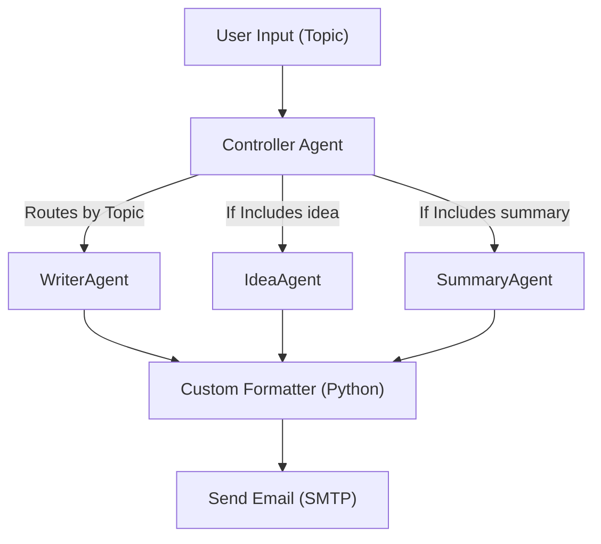

# 📡 Agentic AI System in n8n – Content Creation Assistant

## 🧠 Overview
This project implements an **Agentic AI System** using **n8n**, designed to generate, summarize, and ideate blog content based on user prompts. The system follows a **controller-agent architecture**, orchestrates specialized agents, integrates built-in tools, and includes a custom formatting tool. The final output is automatically emailed to the user.

📄 **[View Full Project Documentation](https://docs.google.com/document/d/17WJ3JPm_xcRrnmYbx7cejaBGP9IA5Up0Q2-AWIMhi-E/edit?usp=sharing)**

---

## 🚀 Features
- Multi-agent routing (WriterAgent, SummaryAgent, IdeaAgent)
- LLM-powered content generation (OpenAI)
- Custom blog formatter in Python
- Automatic email delivery via SMTP
- Visual orchestration via n8n
- Error handling & fallback routing
- Logging via Gmail archive (memory proxy)

---

## 🧱 System Architecture




---

## 🧩 Agents

### 1. Controller Agent (`Code Node`)
- Reads topic input
- Routes to correct agent based on keywords
- Handles errors and falls back to WriterAgent

### 2. WriterAgent
- Generates blog content from topic prompt
- Uses OpenAI or any LLM service

### 3. IdeaAgent
- Brainstorms creative blog topics or titles

### 4. SummaryAgent
- Summarizes blog content or topics

---

## 🧰 Tools Used

### ✅ Built-in Tools (3)
| Tool                | Purpose                                |
|---------------------|----------------------------------------|
| Web Search (LLM)    | Retrieves topic content                |
| Formatter (Python)  | Formats content into HTML/Markdown     |
| Email (SMTP Node)   | Sends content to user                  |

### 🛠️ Custom Tool: Blog Formatter
- **Language**: Python (Code Node)
- **Function**: Formats LLM raw output into clean HTML
- **Input**: `json.text`
- **Output**: `json.formatted_prompt`
- **Edge Case Handling**: Checks for valid text blocks and snippet types

---

## 🧪 Error Handling
- The Controller Agent includes a try/except block
- If the topic is missing or unrecognized, it defaults to `WriterAgent`
- An `error` field is added to `json` if exceptions occur

---

## 💾 Memory System
- Emails are archived in Gmail → acts as indirect memory log
- Optionally extend with Notion or Google Sheets for persistent memory

---

## 📬 Output Sample

### Email Subject:
`AI in Education`

### Email Body (HTML-formatted):
```html
<h2>Personalized Learning</h2>
<p>AI adapts content to student needs...</p>
<h2>Efficiency</h2>
<ul>
  <li>Automates grading</li>
  <li>Optimizes schedules</li>
</ul>
```

---

## 🔧 Setup Instructions
1. **Clone this repo** or import your n8n workflow JSON
2. Ensure the following environment:
   - n8n >= v1.100
   - SMTP credentials or Gmail App Password
3. Install necessary credentials:
   - OpenAI API Key
   - Email SMTP (e.g., Gmail with App Password)
4. Configure the nodes:
   - Paste your OpenAI key in the LLM node
   - Set recipient email address in SMTP node
5. Run the workflow via Webhook or Manual trigger

---

## 📝 Prompt Example
```text
"Generate a full-length blog post on the topic '{{ $json.topic }}'. Format the content using clean HTML. Do not include follow-up questions or links."
```

---

## 📈 Evaluation Highlights
| Category           | Fulfilled? |
|--------------------|------------|
| Controller Agent   | ✅          |
| Specialized Agents | ✅          |
| 3 Built-in Tools   | ✅          |
| Custom Tool        | ✅          |
| Memory System      | ✅ (via Gmail) |
| Error Handling     | ✅          |
| Clear Demo Output  | ✅          |

---

## 🧠 Limitations & Future Work
- Currently limited to keyword routing (enhance with NLP)
- Format improvements for markdown support (optional)

---

## 📚 Credits
Built with ❤️ using [n8n](https://n8n.io), OpenAI, and SMTP.
